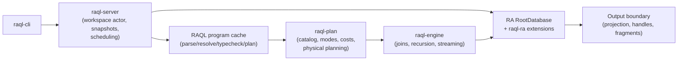

# RAQL System Specification

**Status:** draft for the 2026-08 architecture reset ("native-native").
**Supersedes:** the runtime/host architecture implied by `docs/initial_plans/design_sketch.md` and the current `raql-host` / `raql-host-ra` implementation.
**Does not supersede:** the product/UX contract in `docs/initial_plans/spec_sketch.md` (lenses, fragments, render modes, budgets, elision). That document remains the rendering and CLI-surface spec; this document defines the semantic runtime underneath it. Where the two conflict on identity or truth semantics, this document wins.
**Language reference:** `docs/initial_plans/language_spec.md` remains the syntax/semantics reference for the Datalog core, amended by §8–§11 of this document (binding modes, demand propagation, and failure semantics are now normative parts of the language).

Normative keywords **MUST**, **MUST NOT**, **SHOULD**, **MAY** are used in the RFC-2119 sense.

---

## 1. Thesis

> RAQL is not a database of Rust facts. rust-analyzer already is that database. RAQL is a binding-aware query planner and execution engine whose leaf operators are rust-analyzer/Salsa queries.

Consequences, all normative:

- rust-analyzer (RA) owns workspace membership, syntax, names, types, identity, macro expansion, and reference search. Salsa owns dependency tracking and invalidation.
- RAQL **MUST NOT** copy the workspace into a second fact database. There is no RAQL-side fact store whose staleness RAQL must manage.
- RAQL **MUST NOT** reconstruct RA identity from names, paths, spans, or hashes during evaluation. Identity is RA handles, live inside one snapshot.
- Every traversal starts from an RA-owned identity and happens inside a query whose dependencies are Salsa-visible.
- If RA cannot answer a semantic question honestly, the predicate (or the mode) does not exist. Honest refusal beats approximate success.
- Deterministic text and IDs are produced at the output boundary only. They are projections, never semantic identity.

**Acceptance condition for the whole system:** there is no RAQL cache to invalidate when Rust code changes. We apply the change to the RA database; Salsa makes the next query correct.

## 2. Consumer and design priorities

The primary consumer is an agent (Claude and peers) working in Rust codebases; humans are secondary. This ranks the design pressures:

1. **Trustworthiness over coverage.** A silently-partial answer forces the agent to re-verify with grep, which makes the tool net-negative. Plan-time refusal with a precise error is a feature.
2. **Bound-first workload.** The dominant queries are seeded: "callers of X", "what implements T", "surface of this type", "trace this error". Whole-workspace analytics are occasional and may be visibly expensive.
3. **Constructible selectors.** The agent must be able to *write* a selector from reading code (`crate::mod::Type::method`), not just replay one it was handed. Hashes fail this test.
4. **Visible cost.** The planner's choices and their cost class are part of the output contract (`explain`), so the agent can negotiate with the tool instead of guessing.
5. **Freshness.** The agent edits while it queries. Answers reflect the current state of the RA database at snapshot time, always.

## 3. Glossary

| Term | Meaning |
|---|---|
| **Snapshot** | A clone of the RA `RootDatabase` taken from the server's `AnalysisHost` for one request. Canceled when the host applies a change. |
| **Revision** | The server-local monotonic counter incremented on every `apply_change`. Session-scoped; not a content hash. |
| **Def** | An RA-owned definition identity (`hir::Function`, `hir::Adt`, …) valid within one snapshot. |
| **Selector** | A user/agent-supplied reference to a Def: handle, qualified name, bare name, or `file:line` position. Resolved fresh through RA per request. |
| **Handle** | The printable serialization of a semantic selector (`@H:fn:crate::path::name`). Not identity; a recipe for re-resolution. |
| **Predicate** | A named relation in the RAQL language. Either *extern* (implemented by an RA operator) or *derived* (defined by RAQL rules). |
| **Binding pattern / mode** | Which arguments of a predicate call are bound (`+`) vs free (`-`) at the time the goal runs. |
| **Access path / operator** | The physical implementation of one (predicate, mode) pair in terms of RA API calls. |
| **Scan** | An access path whose mode binds nothing (or nothing selective): an explicit enumeration of a crate- or workspace-sized domain. |
| **Cost class** | The declared asymptotic cost band of an access path (§8.3). |
| **Demand propagation** | Compiling derived predicates per call-site binding pattern so bindings flow into rule bodies instead of evaluating whole strata bottom-up (§9). |

## 4. Truth contract

### 4.1 Entity identity

- Inside one request, entity values are live RA handles (§7). They **MUST NOT** escape the snapshot that produced them.
- RAQL **MUST NOT** intern paths/spans into numeric IDs and treat them as the entity, and **MUST NOT** maintain maps whose purpose is to turn such IDs back into meaning.
- Cross-request identity does not exist. What crosses requests is a *selector*, re-resolved fresh (§13.2). Failure to re-resolve is a visible, typed outcome — never a silent fallback.

### 4.2 Snapshot consistency

- Every request executes against exactly one snapshot. All facts observed by one query evaluation come from the same revision.
- Snapshots are canceled by writes: RA documents that applying a change cancels outstanding snapshots (`vendor/rust-analyzer/crates/ide/src/lib.rs:197-201`, `:238-241`). Cancellation and retry semantics are in §11.5.
- Responses carry the revision and workspace fingerprint they were computed at (§13.3).

### 4.3 Completeness

Every extern predicate declares a completeness class in the catalog (§8.4). There are exactly three:

- `ra_exact` — complete with respect to RA's semantic model for the declared scope (workspace / crate / definition-local). E.g. fields of a struct, variants of an enum, outgoing calls in a body.
- `ra_resolved` — as complete as RA's name/type resolution; sites RA cannot resolve are *absent* and the predicate documentation says so. E.g. incoming callers (bounded by reference search + resolution), trait dispatch targets.
- `disabled` — the honest implementation doesn't exist yet; the predicate is not queryable and fails at *compile* time with a capability error naming it.

There is no fourth class. "Approximately complete" is not a class; an approximate extractor is `disabled` until it is honest.

### 4.4 Failure semantics

| Failure | When | Surface |
|---|---|---|
| Unsupported binding pattern | plan time | `RAQL0301` with the goal, the tried modes, and which argument(s) to bind (§10.3) |
| Predicate disabled | plan time | capability error naming the predicate and its status |
| Scan refused under `--no-scan` | plan time | `RAQL0310` naming the scan and its cost class |
| Selector fails to resolve | request setup | typed resolution result (ambiguous → candidates list; missing → nearest matches), never a guess |
| Snapshot canceled, retries exhausted | run time | `E_CANCELLED` with retry hint |
| Recursion iteration cap hit | run time | `EvalStatus::Partial`, prominently flagged in output; partial results are labeled, never silently returned |
| Output projection fails (e.g. no canonical path) | render time | explicit `<unprojectable:reason>` marker in the artifact; **MUST NOT** substitute a fabricated path or ID |

## 5. Architecture

### 5.1 Layers and crates



Ownership boundaries (normative; crate names are canonical for new code, and §17.1 maps today's crates onto them):

| Layer / crate | Owns | Must not own |
|---|---|---|
| `raql-syntax`, `raql-compiler`, `raql-ir` (the **lang** layer) | Parsing, includes, name resolution, typechecking, stratification, logical rules, mode *checking* (§9–§10 front half) | Any RA type; any physical operator knowledge beyond the catalog's declared signatures |
| `raql-plan` | The predicate catalog (single source of truth, §8.1), binding-mode validation, demand transformation, cost model, physical plan construction | Executing anything; touching RA |
| `raql-ra` | The RA database extension (tracked queries, §6), all RA-native operator implementations, selector resolution, output projection of RA values | Process lifecycle, sockets, engine semantics |
| `raql-engine` | Row execution over live RA values: joins, recursion, negation, aggregation, per-request memoization | Rust semantic discovery; any RA API call other than invoking `raql-ra` operators through the operator trait |
| `raql-server` | One `AnalysisHost` + VFS actor, change pipeline, Cargo reloads, snapshot-per-request, cancellation/retry, request concurrency, the RAQL program cache | Semantic extraction of any kind |
| `raql-protocol` | Serialized request/result types only | Logic |
| `raql-cli` | Thin client; local `check` UX (offline: parse/typecheck/mode-check against the static catalog, no daemon needed) | Any execution path that bypasses the server |

Deleted concepts (no successor): `HostRuntime`, `DeterministicRaHost`, `EngineHostView::extern_relation_rows` (bulk relation pull), `CoreLookupIndex`, `CoreHostBuildSpec`, `lookup_defs/lookup_spans/lookup_nodes` caches, custom world stamps as language predicates, stable-key fallbacks, synthetic definitions, the generic multi-backend host abstraction. We have one semantic backend; abstraction over hypothetical others is forbidden.

### 5.2 Two incremental databases

There are two independent incremental worlds and they **MUST NOT** share a Salsa database:

1. **Rust workspace state** — RA's `RootDatabase` (already Salsa: `vendor/rust-analyzer/crates/ide-db/src/lib.rs:82-98`), extended with RAQL tracked queries (§6).
2. **RAQL program state** — query source files, include resolution, parsing, name resolution, typechecking, physical planning.

Rationale: editing a `.raql` file must not advance the Rust database revision and cancel live Rust-analysis snapshots, and vice versa.

v0 decision: the RAQL program side is a **content-addressed cache**, not Salsa. Key = `blake3(source text of entry file ++ resolved include closure texts ++ catalog version ++ compiler version)`; value = the typed, planned program. This is simpler than a second Salsa instance and sufficient because RAQL programs are small. Upgrading to Salsa later is permitted but not planned. (The existing daemon `PlanCache` is the seed of this.)

### 5.3 Dataflow of one request

1. Client sends `(program source | view name, selector bindings, options)` via `raql-protocol`.
2. Server resolves the program through the program cache (compile on miss: parse → resolve → typecheck → stratify → mode-check → plan).
3. Server resolves selectors to Defs through `raql-ra` against a fresh snapshot (§13.2). Ambiguity returns the Alternatives contract from `spec_sketch.md`, not a guess.
4. Engine executes the physical plan against the snapshot. RA values flow through joins as live handles.
5. Output boundary projects final rows into fragments/metrics (per `spec_sketch.md`) or raw JSONL rows; Defs render as canonical path + location + handle; response is stamped (§13.3).

## 6. The RA database extension (`raql-ra`)

### 6.1 Mechanism

RA's `RootDatabase` is a new-Salsa database (`#[salsa_macros::db]`, `salsa::Storage<Self>`) and RA explicitly supports extending it from third-party crates — see the note on `load_workspace_into_db`: "salsa supports extending foreign databases (e.g. `RootDatabase`)" (`vendor/rust-analyzer/crates/load-cargo/src/lib.rs:94-99`).

Mechanism (decided by the step-2 spike; see §18.1): upstream RA removed its `query_group` macro, and its current idiom for a derived query over the database is a plain free function wrapping a `#[salsa::interned]` key struct and a `#[salsa::tracked]` function (the model is `line_index`, `vendor/rust-analyzer/crates/ide-db/src/lib.rs:256-271`). `raql-ra` follows that idiom exactly — no extension trait, no raql-ra database type:

```rust
pub fn raql_callees(db: &dyn HirDatabase, f: hir::Function) -> Arc<[CallSite]> {
    #[salsa::interned]
    struct InternedFunction {
        #[returns(copy)]
        f: hir::Function,
    }

    #[salsa::tracked(returns(ref))]
    fn raql_callees<'db>(db: &'db dyn HirDatabase, f: InternedFunction<'db>) -> Arc<[CallSite]> {
        // Salsa may (re-)execute this from any caller's verification stack;
        // hir type resolution needs the TLS-attached database, so the body
        // self-attaches (re-attaching the same db is a no-op).
        hir::attach_db(db, || compute_callees(db, f.f(db)))
    }

    raql_callees(db, InternedFunction::new(db, f)).clone()
}
// grows one query per meaningful reusable derived computation, and no faster
```

(`hir::Function` is `Clone, Copy, PartialEq, Eq, Hash` — an interned-ID wrapper (`vendor/rust-analyzer/crates/hir/src/lib.rs:2189-2192`) — and the spike's G6 proved it, and `hir::Adt`, as tracked-query keys that persist across revisions while the item persists.)

Because these are Salsa queries executing over RA queries, their invalidation is derived from the RA queries they actually invoke. No RAQL-side invalidation logic exists.

### 6.2 When to add a tracked query — and when not to

Add a tracked query **only** when it represents meaningful reusable derived work whose recomputation you want Salsa to manage (e.g. "resolved call edges of this body", which costs a body traversal + resolution).

Do **not** Salsa-cache trivial projections to feel native. If `def.name(db)` is cheap and already backed by Salsa internally, the operator calls it directly. The default for a new operator is *untracked* (plain function over the snapshot); tracking is an optimization added with evidence.

Expected dependency width is part of each query's design review:

- `raql_callees` — **narrow**: one body's syntax + resolution. Invalidated by edits to that body (and its macro inputs). Caches beautifully.
- `raql_callers` — **wide**: reference search reads every file the name's text-prefilter touches. Any edit to those files invalidates it. This is inherent, not a bug; it bounds what "warm" means for incoming-caller queries (§15) and MUST NOT be papered over with a custom cache.
- `raql_crate_defs` — moderate: a crate's def maps.

### 6.3 Identity-first operators, not IDE re-use

RA's public IDE layer is position-based and identity-lossy: `Analysis::incoming_calls/outgoing_calls` take a `FilePosition` and return `CallItem { target: NavigationTarget, .. }` (`vendor/rust-analyzer/crates/ide/src/lib.rs:648-665`). A `NavigationTarget` has lost the `hir` handle.

Rule: operators **adapt the IDE implementation, keep the HIR identity**. `raql_callees`/`raql_callers` are re-implementations of `ide::call_hierarchy`'s bodies (`Semantics`, `NameRefClass::classify`, `Definition::usages` — see `vendor/rust-analyzer/crates/ide/src/call_hierarchy.rs`) that take and return `hir` handles. Where an RA API only exists in identity-lossy form and reimplementation is not viable, the options are (in order): expose a narrow identity-first API in `raql-ra`, or upstream a patch to RA. Reverse-resolving a `NavigationTarget` back to a Def is forbidden.

Macro-aware spans: operators MUST use RA's source-map/`original_range` machinery for span projection so call sites inside macro expansions map to the primary source location, matching RA's own behavior. Closures: no closure-as-definition edges unless RA exposes an honest callable identity for them; until then callsites whose callee is a closure or fn-pointer with no resolvable Def are simply absent from `call_edge` (documented per §4.3 as an `ra_resolved` caveat).

### 6.4 Feasibility spike (build-sequence step 2) — gates

The spike extends `RootDatabase` with exactly one tracked query (`raql_callees`) and must pass all gates before any further system design hardens:

- **G1 (compiles):** the extension trait compiles against the pinned RA rev, and the server can construct/load the extended database via `load_workspace_into_db`.
- **G2 (memoizes):** two consecutive calls with the same `hir::Function` on the same revision execute the body once (asserted via a call counter or salsa event log).
- **G3 (invalidates precisely):** an edit to an unrelated file does not recompute it; an edit to the function's body does.
- **G4 (cancels):** `apply_change` during an in-flight evaluation unwinds with Salsa cancellation; the request layer catches at the boundary and a retry succeeds.
- **G5 (no shadow state):** the slice contains no RAQL-side revision counter, mtime map, or cache. Grep-able.
- **G6 (keys):** `hir::Function` (and one ADT handle) works as a tracked-query key across revisions where the item persists. If any public HIR handle proves unusable as a key, the fallback design (interning a raql-ra-owned key struct from the HIR handle's stable parts) must be written down before proceeding.

Record cold/warm timings for the spike query as the first data points of §15.

### 6.5 RA version pinning

RA is consumed as pinned git dependencies (workspace `Cargo.toml:59-68`, rev `b2d445b22a2dd4c3469dfeddc2d5eb533c42baf6`) and the same tree is vendored at `vendor/rust-analyzer` for reference (a full clone, kept out of git). Invariants:

- The vendored tree and the Cargo pin **MUST** reference the same rev; bumping one bumps both in the same change.
- RA upgrades are deliberate events with the conformance suite (§16) as the gate, expected a few times a year, not tracked continuously.

## 7. Value model

Engine values during evaluation:

```rust
enum Value {
    // RA-owned identities (snapshot-scoped, never serialized)
    Function(hir::Function),
    Adt(hir::Adt),
    Trait(hir::Trait),
    // (TraitAlias: removed upstream on the pinned RA rev; no successor.)
    Module(hir::Module),
    Const(hir::Const),
    Static(hir::Static),
    TypeAlias(hir::TypeAlias),
    Macro(hir::Macro),
    Impl(hir::Impl),
    Field(hir::Field),
    Variant(hir::EnumVariant),
    // Positions (snapshot-scoped file ids)
    FileRange(ide_db::FileRange),
    // Opaque RA-derived composites defined by raql-ra (e.g. a resolved call site)
    Site(raql_ra::CallSiteId),
    Type(raql_ra::TypeRefId),
    // Plain data
    String(Arc<str>),
    Int(i64),
    Bool(bool),
    Enum(EnumTag),           // language enums (DefKind, DispatchKind, …)
    Option(Option<Box<Value>>),
}
```

Rules:

- The `Def` language type is the union of the `hir::*` definition variants; `def_kind` is a projection of the variant, not a stored field. (The implementation groups these variants under a single `Value::Def(Def)` union type in `raql-ra`; that is the same model, stated once.)
- Values are `Clone`-cheap (RA handles are `Copy` IDs). Rows are small tuples of these.
- Nothing in `Value` is serializable. Serialization happens only at the output boundary (§13) by *projecting* values, and the projection is a distinct type in `raql-protocol`.
- Total ordering for deterministic output: ordering of RA handles is **not** semantic. Sorting for output MUST happen after projection (by canonical path, then span). Engine-internal ordering (join order, set semantics) uses the handles' `Eq + Hash` only.

## 8. Predicate catalog

### 8.1 Single source of truth

The catalog lives in `raql-plan` as one declarative Rust registry. Each entry declares: name, typed argument schema, documentation, completeness class + caveats, and the full set of supported modes, each with cost class and operator binding.

From this one registry are generated (mechanically, no drift possible):

1. Extern predicate signatures and modes for the compiler (the `.decl … extern` / `.mode` blocks disappear from `std.raql`; the stdlib file retains only derived rules and output helpers).
2. Planner operator dispatch tables.
3. `raql capabilities` output (per-predicate status, modes, costs, RA primitives used).
4. Reference documentation.
5. Conformance test skeletons (§16): one truth fixture + one mode-rejection case per entry, enforced by a registry-walking test that fails on any uncovered entry.

A predicate not in the registry does not exist. A mode not in the registry is a plan error. There is no handwritten capability list anywhere else.

### 8.2 Mode declarations

A mode is a tuple over the predicate's arguments from `{+, -}`: `+` = must be bound when the goal runs; `-` = the operator binds it. A goal is *plannable* if the set of bound arguments at its position in the (reordered) rule body is a superset of some declared mode's `+` set. The planner picks the cheapest satisfiable mode (§10.2).

### 8.3 Cost classes

| Class | Meaning | Examples |
|---|---|---|
| `C0` | O(1) projection of an already-interned value | `def_kind(+,-)`, `span_key(+,…)` |
| `C1` | Definition-local work: one body/item traversal, one def-map path walk | `callee(+,…)`, `def_path(+,-)`, `field(+,…)`, `def_at(+,+,-)` |
| `C2` | Name-bounded search: symbol-index query or text-prefiltered reference search | `def_name(-,+)`, `caller(+,…)`, `implements(-,+, …)` |
| `C3` | Crate-wide enumeration (def-map traversal of one crate) | `def(-)` scoped to a crate |
| `C4` | Workspace-wide enumeration or scan composition | `def(-)` workspace, `call_edge(-,-,…)` |

Costs are honest bands for planning and explain output, not measurements.

### 8.4 Completeness classes

Per §4.3: `ra_exact`, `ra_resolved` (with named caveats, e.g. `unresolved_callsites_absent`, `macro_expansion_spans`), `disabled`.

An individual access path MAY carry additional named caveats of its own beyond the predicate's class, when that path's index cannot surface part of the predicate's domain (e.g. `def_name(-,+)`'s `fields_not_in_symbol_index`: the symbol index never surfaces fields, so a field is seeded via its owner, not by name). Mode caveats appear in capabilities output next to their mode.

### 8.5 Scans are explicit access paths

- A scan is a declared mode like any other, marked `scan` and carrying `C3`/`C4`. It is never inferred and never a fallback: the old engine behavior (one unplannable goal anywhere silently flips the predicate to bulk materialization — `raql-engine/src/lib.rs:639,697` today) is deleted.
- Scans are **allowed by default and visible always**: any plan containing a scan reports it in `explain` output and in the response metadata (`scans: [call_edge/C4]`). The request option `--no-scan` (protocol: `deny_scans: true`) makes any scan a plan-time `RAQL0310` error.
- Composite scans are defined per-predicate in the catalog as rewrites onto enumeration + a bound mode. Normative example — unbound `call_edge`:

  ```
  call_edge(-C, -K, -S, -D)  ⇒  fn_def(C), callee(C, K, S, D)
  ```

  i.e. enumerate function defs (def-map traversal), expand each via the *outgoing* operator (body-local, narrow Salsa deps). Scan composition **MUST NOT** route through reference search (`caller`) — the wide direction is never the enumerator.
- Negated goals **MUST NOT** contain scans in v0: after demand propagation, a goal under `not` must have a non-scan satisfiable mode, and a demanded specialization reached from under `not` must be transitively scan-free (violation: `RAQL0311` at plan time). (Revisit once scan latency is characterized.)

### 8.6 v0 catalog (normative)

The minimal vertical slice (build-sequence step 3). Types: `Def`, `Span`, `File`, `Position`, `Name = string`, enums per `std.raql`.

"Workspace" scope for scans and seeds is RA's own local/library partition (`CrateOrigin::is_local`): workspace members **and** path dependencies — editable code — never registry/git dependencies or the sysroot. The `def_name(-,+)` seed and the enumeration scans MUST agree on this domain.

| Predicate | Modes (cost) | Operator (RA primitives) | Completeness |
|---|---|---|---|
| `def_name(D, Name)` | `(+,-)` C0; `(-,+)` C2; `scan (-,-)` C3/C4 | projection via `hir` name; exact-name seed via symbol index (`ide_db::symbol_index`, as in current host-ra); scan = `raql_crate_defs` × projection | `ra_exact` |
| `def_at(File, Pos, D)` | `(+,+,-)` C1 | `Semantics` classify-at-offset (goto-definition shape) | `ra_resolved` |
| `def_kind(D, K)` | `(+,-)` C0 | variant projection of `Value::*` | `ra_exact` |
| `def_path(D, P)` | `(+,-)` C1 | canonical module path via def maps (not re-export paths) | `ra_exact` |
| `def_span(D, S)` | `(+,-)` C1 | `original_range` of the name/item source | `ra_exact`, caveat `macro_expansion_spans` |
| `def(D)` | `scan (-)` C3 (crate) / C4 (workspace) | `raql_crate_defs` per crate; workspace = union over `hir::Crate::all` in-workspace | `ra_exact` |
| `fn_def(D)` | `scan (-)` C3/C4 | `def(D)` filtered to functions during enumeration | `ra_exact` |
| `callee(F, Callee, Site, Disp)` | `(+,-,-,-)` C1 | `raql_callees` — body traversal + resolution, dispatch classified at the callsite | `ra_resolved`, caveat `unresolved_callsites_absent` |
| `caller(F, CallerFn, Site, Disp)` | `(+,-,-,-)` C2 | `raql_callers` — reference search + one ancestor-walk classification (current host-ra logic, kept) | `ra_resolved` |
| `call_edge(C, K, S, D)` | `(+,-,-,-)` C1 → `callee`; `(-,+,-,-)` C2 → `caller`; `scan (-,-,-,-)` C4 → §8.5 rewrite | composition | inherits |
| `is_public(D)` | `(+)` C0 | visibility projection | `ra_exact` |
| `in_test(D)` | `(+)` C1 | cfg/test-module check (RA's `exclude_tests` logic) | `ra_resolved` |
| `span_allowed(S)` | `(+)` C0 | request-scope filter (include-tests etc. compiled to config) | n/a (filter) |
| `handle(D, H)` | `(+,-)` C1 | output-boundary projection exposed to the language (§13.2 grammar) | `ra_exact` |
| `span_key(S, Path, L0, C0, L1, C1)` | `(+,-,-,-,-,-)` C0 | workspace-relative location projection | `ra_exact` |
| `contains/starts_with/fmt/coalesce` | all-`+` C0 | engine-managed builtins (unchanged) | n/a |

v1 families (structure/traits/types: `field`, `variant`, `method`, `trait_method`, `implements`, `from_impl`, `fn_return_type`, `ty_*`, `node_*`, `enclosing_control`) follow the same template: owner-bound modes at C1, trait-bound `implements(-,+,-)` at C2, entering the registry **only** with their proof matrix (§16). The error-flow family (`constructs/propagates/converts/handles`) and reference events (`compares/writes`) are `disabled` until each has an honest RA-native operator; their catalog entries exist with status `disabled` so the capability listing shows the roadmap.

Deleted from the language: `world_stamp` (becomes response metadata, §13.3), `search` as a relation (selection is a request-level operation per `spec_sketch.md`; MAY return as a predicate later with an explicit ranking contract), `call_id/ref_id/impl_id` zero-bound key enumerations.

## 9. Derived predicates and demand propagation

This section exists because binding modes on externs alone do not prevent enumeration. Today `is_fn(D) :- def(D), def_kind(D, FN)` forces a full `def` scan even when `D` is already bound at the call site. That class of leak is closed as follows.

### 9.1 Mode inference for derived predicates

- Every derived predicate `p` has a set of *supported binding patterns*, computed bottom-up over strata:
  `p` supports pattern β iff **every** rule for `p` can be goal-reordered such that, starting from the head variables bound under β, each body goal is invoked with a pattern its own predicate supports (extern: declared modes; derived: inferred set; builtins: their all-`+` requirements; negation: §8.5 rule).
- For recursive SCCs, support is computed as a greatest fixpoint: assume all candidate patterns supported, iteratively remove patterns that fail the rule check, until stable.
- Authors MAY declare `.mode` on derived predicates as an assertion; the compiler errors if a declared mode is not inferable (this keeps stdlib intent honest) and treats declared modes as the public contract even if more are inferable.

### 9.2 Demand-driven compilation

- Each derived predicate is compiled **per distinct call pattern** that actually occurs in the program (specialization, magic-sets-lite). A call to `p` under β with bound arguments `a⃗` evaluates `p`'s rules with `a⃗` as seed bindings, instead of evaluating `p`'s full extent in its stratum.
- Results are memoized per `(predicate, β, a⃗)` within the request. Recursive predicates memoize per SCC evaluation with the seeds as the demand set (standard semi-naive over the demanded subset).
- A call under the empty pattern (nothing bound) is a *scan of a derived predicate*: legal only if every leaf reached is itself plannable under it — which, transitively, means the enumeration bottoms out in declared extern scans. Its cost class is the max of the leaf costs, and it is reported as a scan (§8.5 visibility rules apply).

### 9.3 Stdlib consequences

`std.raql` derived filters are rewritten to bound-first form:

```
.decl is_fn(D: Def).  .mode is_fn(+Def).
is_fn(D) :- def_kind(D, DefKind::FN).
is_fn(D) :- def_kind(D, DefKind::METHOD).
```

Enumeration intent is expressed by the explicit scan predicate (`fn_def(F)`), not by filters that happen to enumerate. `def_allowed`, `is_struct`, `is_enum`, `is_trait` get the same treatment.

## 10. Planner

### 10.1 Contract

Input: stratified, typechecked logical rules + the catalog + the request's selector bindings (selectors arrive as pre-bound input relations, e.g. `target_def`). Output: a physical plan — per-rule ordered goal sequences with, for each goal, the chosen (mode, operator, cost), plus the demand-specialization table for derived predicates, plus plan-level metadata (scans used, max cost class, disabled-predicate check already passed).

Planning is deterministic: same program + same catalog version ⇒ identical plan. The plan is cacheable with the program (§5.2).

### 10.2 Mode/operator selection

Per rule body, greedy reorder with full backtracking (the current compiler's reorderer, upgraded from greedy-only): repeatedly pick the not-yet-placed goal with the cheapest satisfiable mode given current bindings, tie-breaking by (fewer free variables, source order). If no complete ordering exists, backtrack; if no ordering exists at all, emit `RAQL0301`. Scans are considered last at every step (a scan is chosen only if no non-scan goal is placeable).

### 10.3 Plan errors

`RAQL0301` (unsatisfiable modes) message contract — MUST include: the offending goal with argument names; every declared mode of its predicate with cost class; which arguments are currently bound at the failure point; and the minimal set(s) of additional bindings that would unblock it. Example:

```
error[RAQL0301]: no satisfiable access path for `call_edge(Caller, Callee, Site, Disp)`
  bound here: (none)
  supported: call_edge(+Caller, -, -, -)   body-local   [C1]
             call_edge(-, +Callee, -, -)   ref-search   [C2]
             call_edge(-, -, -, -)         scan         [C4]  (denied: --no-scan)
  fix: bind Caller or Callee first (e.g. via def_name/def_at), or allow scans
```

`RAQL0310` (scan denied) and the capability error for `disabled` predicates follow the same shape. Code assignments within the planning family (implemented in `raql-plan/src/error.rs`): `RAQL0302` disabled predicate, `RAQL0303` declared derived mode not inferable (§9.1), `RAQL0304` malformed planner input, `RAQL0311` scan under negation (§8.5).

### 10.4 Explain

`raql lang explain <query>` (and `explain: true` in the protocol) returns the physical plan without executing: per-goal operator, mode, cost class; demand specializations; scans; and the RA primitive names from the catalog. This output is part of the stable interface (agents read it), so its format is versioned with the protocol.

## 11. Engine execution

### 11.1 Core semantics

Set-semantics Datalog, bottom-up least fixpoint per stratum, **restricted by demand** (§9.2). Existing engine semantics for joins, stratified negation, aggregation (`count/count_distinct/sum/min/max`, `choose_topk`), and `witness_path`/`path_hop` bounded reachability are retained as specified in `language_spec.md`.

- Rows are tuples of `Value` (§7); evaluation holds live RA handles throughout.
- Intermediate materialization is request-scoped only: join inputs, recursion deltas, memo tables die with the request. Nothing persists across requests except Salsa's own memoization inside the RA database.
- Recursion SHOULD be semi-naive over the demanded subset; naive iteration is acceptable in v0 behind the same iteration cap (`EvalStatus::Partial` on overflow, flagged per §4.4).
- Join indexing (hash indexes on demanded positions) replaces the current linear relation scans; this is an implementation quality bar, not a semantics change.

### 11.2 Cancellation and retry

- All RA access happens on one snapshot per request. When the server applies a change, RA cancels the snapshot: in-flight RA calls unwind (Salsa cancellation panic).
- The engine **MUST** be unwind-safe: no engine state outlives the request; no locks or shared mutable structures are held across operator calls.
- The server wraps request execution in `catch_unwind` at the request boundary (mirroring RA's own model). On cancellation: take a fresh snapshot and re-execute — attempts: 3, backoff 0ms/50ms/200ms. On exhaustion: `E_CANCELLED` with a "workspace under heavy edit" hint. Retries re-run the whole query; partial results from a canceled attempt are discarded (set semantics makes re-execution safe).
- Long-running scans under edit churn will starve; that is accepted v0 behavior and surfaced honestly by `E_CANCELLED`. Resumable scans are future work, not a v0 requirement.

## 12. Workspace server

### 12.1 Lifecycle

- One process per workspace (daemon model, idle-exit retained). It owns exactly one `AnalysisHost` and one VFS.
- Startup: discover workspace → `load_workspace_into_db` (build scripts and proc-macro server per current config) → prime caches (bounded parallel prewarm, as today).
- Each request gets `host.analysis()` — a database clone (`ide/src/lib.rs:186-190`). Requests never touch the mutable host.

### 12.2 Change pipeline (the only one)

```
filesystem notification (vfs-notify)
→ RA VFS
→ VFS take_changes (drained in batches)
→ ChangeWithProcMacros
→ source-root repartition iff file set/structure changed
→ AnalysisHost::apply_change
→ Salsa invalidation (RA's job, finished)
```

This matches RA's own state machine (`vendor/rust-analyzer/crates/rust-analyzer/src/global_state.rs:335`). The server's change-handling code **MUST** be a small, recognizable adaptation of `GlobalState::process_changes` — reviewable line-by-line against the reference tree — not a novel watcher architecture. Event batches MAY be debounced ≤50ms.

Deleted, with no successor: metadata/mtime state maps, recursive "what changed?" filesystem scans, independent tracked-file sets, custom content revisions, manual cache invalidation/preservation, build.rs text parsing. (The current `sync_workspace` warm-path sweep — self-documented as "the main latency offender" and a "correctness risk", `workspace_service.rs:627` — is the canonical example of what this section forbids.)

### 12.3 Structural reloads

Triggers: any change to `Cargo.toml` (any member), `Cargo.lock`, `build.rs`, `.cargo/config*`, rust-toolchain files, or proc-macro rebuild conditions. Response: a full, correct RA/Cargo workspace reload (re-run `cargo metadata`/build scripts through the load-cargo path, rebuild crate graph, apply as one change). Full reload here is acceptable; a clever incomplete reload is not. Ordinary `.rs` edits **MUST NOT** trigger reloads.

The ideal end-state is RA's non-LSP workspace state machine extracted as a reusable library; until upstream offers that, we maintain the adaptation.

## 13. Output boundary

### 13.1 Projection

At the final projection (and only there), RA values become text:

- Def → canonical path (def-map path, not re-export path) + workspace-relative location + kind + handle.
- Span/FileRange → workspace-relative `path:line:col-line:col` (macro-aware primary location).
- Site/Type composites → their defining projection (callsite location + dispatch; rendered type string via RA's display).
- A value that cannot be projected renders as `<unprojectable:reason>` per §4.4. No fallback paths, no fallback IDs.

Fragments, render modes, budgets, elision text: per `spec_sketch.md`, unchanged by this document.

### 13.2 Handles and selectors

Handle grammar:

```
handle         = "@H:" kind ":" canonical-path [ "#" ordinal ]
kind           = "fn" | "struct" | "enum" | "union" | "trait" | "mod" | "impl"
               | "type" | "const" | "static" | "field" | "variant" | "macro"
canonical-path = crate-name "::" segment { "::" segment }
ordinal        = decimal          ; only when several defs share kind+path (e.g. impls),
                                  ; numbered in stable source order
```

- A handle is a **semantic selector**, not identity: no hashes, no revision, no session scoping. It is valid input forever; its *meaning* is recomputed fresh through RA on every use.
- `resolve(selector) → Resolution` where `Resolution = Exact(Def) | Renamed(Def, note) | Ambiguous(candidates ≤ N) | Missing(nearest ≤ N)`. `Renamed` covers unique kind+name matches found via symbol index when the module path moved. `Ambiguous`/`Missing` surface the `spec_sketch.md` Alternatives contract. Nothing in this pipeline guesses silently.
- Accepted selector forms (per `spec_sketch.md`): handle, qualified name, bare name (fuzzy → Alternatives), `path:line[/needle]` position (resolved via `def_at`).

### 13.3 World stamp

Response metadata (not a language predicate):

- `revision`: `r<N>@<server-epoch-uuid>` — N increments on every `apply_change`; the UUID is minted at server start. Orders responses within a server lifetime; detects cross-response consistency.
- `workspace_fingerprint`: `blake3(Cargo.lock ++ sorted manifest paths)` truncated — coarse cross-session workspace identity.
- `plan`: scans used, max cost class, and (when `explain` was requested) the full plan.

### 13.4 JSONL

Fragment/metric event shapes per `spec_sketch.md`, plus every stream begins with a `meta` event carrying §13.3 fields and ends with a `status` event (`ok | partial | cancelled`, elision counts).

## 14. Protocol

`raql-protocol` defines serialized types only: `Request { program | view, selectors, options { deny_scans, explain, budgets, scope } }`, `Response = stream of Event { meta | fragment | metric | row | note | status }`, and the error taxonomy (§4.4 codes). No RA types, no engine types, no semantic logic. Versioned; `explain` output format is part of the version.

## 15. Latency contract

Measurement rules (unchanged from `AGENTS.md`): release-mode, daemon-backed runs only; debug timings are not decision-grade.

Probes (all in `views/`, executed via the public CLI path):

| Probe | Shape | Target (this repo, warm daemon) |
|---|---|---|
| P1 `stdlib_callers_load_and_plan.raql` | seeded incoming-callers + aggregation (the wide-dependency worst case — kept as the honest headline probe) | ≤ 500ms first-after-edit; ≤ 100ms repeat |
| P2 exact-name seed → projections | `def_name(-,+)` C2 + C0/C1 projections | ≤ 100ms p95 |
| P3 edit-refresh | single `.rs` body edit, then P2 | ≤ 300ms |
| P4 scan probe (`stdlib_dispatch_hotspots.raql`, rewritten onto the explicit scan) | C4 scan + aggregation | measured and reported; no hard target v0 |
| Cold | daemon start → P2 | ≤ 5s |

Reference points from the current tree (for regression sense, not as gates): warm ~59–69ms, cold ~4.1s. The rewrite's claim is *correctness with equal-or-better latency*, with cold improving as demand-driven evaluation replaces `world_symbols("")`-style enumeration; warm incoming-callers is bounded by RA reference search and is not marketed below that.

A `tests/latency_smoke.rs` harness (the never-built Chunk-6 item) becomes mandatory at cutover: it runs P1–P4 against the release binary and writes a machine-readable report; CI gates on "no bucket regresses >25% vs recorded baseline".

## 16. Testing and conformance

Per catalog entry (registry-walked; a missing artifact fails the meta-test):

1. **Truth fixtures** — a purpose-built fixture crate exercising the predicate including at least: macro-expansion site, trait/dyn dispatch (call family), cfg-gated item. Assert exact row sets after projection.
2. **Mode matrix** — every declared mode executed; at least one undeclared pattern asserted to fail with `RAQL0301` at plan time.
3. **Incrementality** — for each tracked query backing the entry: the G2/G3 assertions (memoized; precise invalidation) as automated tests using salsa event capture.
4. **Cancellation** — one test per operator family that a mid-flight `apply_change` unwinds cleanly and a retry succeeds (G4 generalized).

System-level:

- **Conformance corpus** (4 pinned repos: hashbrown, serde, rust-analyzer, tokio) — during cutover, shadow-run old vs new on the shared query set; differences must be explained (old-host bug vs new-runtime bug) before deletion of the old path. Post-cutover the corpus runs against the new runtime only.
- **Preserved as specifications**: RAQL syntax/rule semantics tests, typechecking behavior, engine recursion/join/negation/aggregation tests, truth cases discovered by the current implementation (ported to fixtures), latency probes.

## 17. Migration from the current tree

### 17.1 Disposition map

| Current artifact | Fate |
|---|---|
| `raql-syntax`, `raql-compiler`, `raql-ir` | **Keep** (the lang layer). Compiler gains: catalog-fed extern signatures, derived-mode inference (§9.1), backtracking reorderer (§10.2), error format (§10.3). `supports_zero_bound_relation_lookup` allowlist → replaced by catalog scan modes. |
| `raql-engine` | **Keep, refit**: delete `extern_relation_rows` bulk path + `inject_host_extern_relations` + all-or-nothing lookup coverage (`lib.rs:630-733`); operators invoked through a new `raql-plan` operator trait; add demand memoization + join indexes. Join/recursion/negation/aggregation semantics and tests survive. |
| `raql-host` (`HostRuntime`, `ExternLookup*` vocabulary) | **Delete.** The operator trait in `raql-plan` + `Value` (§7) replace it. |
| `raql-host-ra` — `DeterministicRaHost`, `extract_*` phases, `CoreHostBuildSpec`, `ensure_core_host`, `build_core_host` | **Delete.** |
| `raql-host-ra` — keyed providers (`extern_lookup_rows` match, `call_lookup`, `def_name` seeding, callsite dispatch classification, `def_at`-shaped logic) | **Port** into `raql-ra` operators; this is the code that survives conceptually. |
| `raql-host-ra` — `CoreLookupIndex`, `lookup_defs/spans/nodes`, `invalidate_paths`, fingerprints | **Delete**; replaced by Salsa-tracked queries (§6). |
| `raql-host-ra` — `workspace_loader`, watch, `sync_workspace`, tracking | **Replace** with the §12.2 pipeline in `raql-server` (GlobalState adaptation). |
| `raql-daemon` | **Becomes `raql-server`** (rename + absorb §12; sheds any semantic logic). `PlanCache` seeds the program cache (§5.2). |
| `raql-protocol`, `raql-cli` | **Keep**; protocol re-cut per §14. |
| `std.raql` | **Rewrite**: extern/`.mode` decls move to the catalog; derived rules per §9.3; output helpers unchanged. |
| `views/*.raql` | P1 kept as-is; hotspots/error-conversions rewritten onto explicit scans (error-conversions stays dark until its family leaves `disabled`). |
| `world_stamp`, `handle` stable-key fallbacks, synthetic defs | **Delete** (`world_stamp` → §13.3 metadata; `handle` → §13.2 projection). |

### 17.2 Build sequence and gates

1. **Truth contract** — this document merged; `AGENTS.md` invariants updated to cite it. *Gate: none (docs).*
2. **RA/Salsa spike** — §6.4, all gates G1–G6. *Hard gate for everything below.*
3. **Minimal vertical slice** — §8.6 catalog v0 wired end-to-end (server → plan → engine → raql-ra → projection) for `def_name`, `def_at`, `def_kind/path/span`, bound `callee`/`caller`. Run against this repo and `vendor/rust-analyzer`. *Gate: truth fixtures + P2 within target.*
4. **Binding-aware planner** — §9–§10 complete: demand propagation, backtracking reorder, `RAQL0301/0310` formats, `explain`. *Gate: mode matrix green; `is_fn`-style probe shows no `def` enumeration when seeded (assert via salsa event capture or operator-call counters).*
5. **Workspace actor** — §12 pipeline incl. create/delete/rename, repartition, structural reloads. *Gate: edit matrix tests + P3 within target; grep-gate: no mtime/rescan code.*
6. **Streaming engine refit** — §11 (demand memoization, join indexes, unwind safety, retry). *Gate: engine test suite + cancellation tests green.*
7. **Semantic expansion** — v1 families one at a time, each entering the catalog with its full §16 matrix.
8. **Cutover** — shadow old vs new on the conformance corpus; explain every diff; delete the old host path; `raql-server` becomes the only execution path; latency harness becomes CI gate. *Gate: corpus parity report + latency report checked into `docs/`.*

## 18. Open questions (tracked, not blocking)

1. **Salsa extension ergonomics** — ~~`query_group` macro vs raw `#[salsa::tracked]` functions with raql-ra-interned key structs~~ **Decided by the spike (2026-08-11):** upstream removed `query_group`; raql-ra uses free functions wrapping `#[salsa::interned]` key structs + `#[salsa::tracked]` functions, RA's own current idiom (§6.1). All gates G1–G6 passed on rev `b2d445b22a`.
2. **Impl handle ordinal stability** — source-order ordinals shift when impls are reordered; acceptable for a re-resolved selector, but consider `impl<Trait-for-Type>` naming if churn hurts in practice.
3. **Closure identity** — whether RA's closure representation can honestly back closure-as-callable; until then closures appear only as dispatch classification at callsites.
4. **Negation over scans** — forbidden v0 (§8.5); revisit with scan latency data.
5. **`search` as a predicate** — needs a ranking-determinism contract before re-entering the catalog.
6. **Resumable scans under edit churn** — future work once `E_CANCELLED` starvation is observed in practice.
7. **RAQL-program Salsa upgrade** — only if `.raql` programs grow large enough that content-addressed caching thrashes.
8. **Tracked `raql_callers`** — ide-db's `Definition::usages` is typed over concrete `RootDatabase`, which a dyn-db tracked body cannot name, so `caller` runs as an untracked operator (per-request recompute; §6.2's default). Revisit via an upstream dyn-ification patch or an identity-first reimplementation of reference search, with warm-latency evidence deciding whether tracking is worth it (its dependency set is inherently wide, §6.2).
